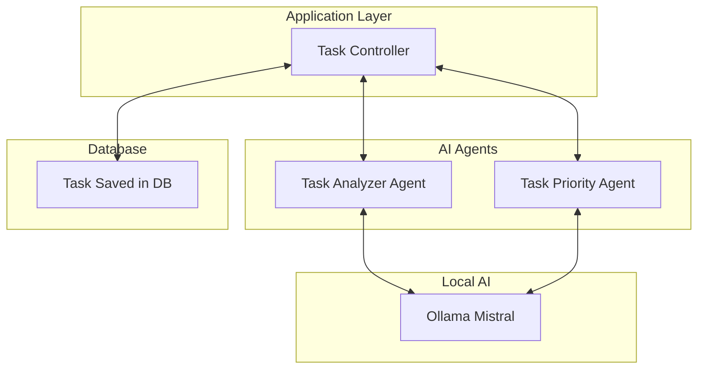

# Smart Task Manager (AI-Assisted)

## 🚀 Overview

Smart Task Manager is a REST API built using Spring Boot and enhanced with GitHub Copilot to demonstrate AI-assisted software development practices.
The project demonstrates AI-assisted development workflows, multi-agent orchestration, and developer productivity enhancements.

## 🎯 Objectives

* Practice and implement the learnings of [GH-300](https://learn.microsoft.com/en-us/credentials/certifications/github-copilot/)

---

## 🧠 AI-Assisted Development

This project is developed using GitHub Copilot to:

* Generate boilerplate code
* Refactor existing logic
* Create test cases
* Add documentation
* Improve code quality

---

## 🛠 Tech Stack

* Java
* Spring Boot
* REST APIs
* GitHub Copilot
* Maven

### ☁️ Cloud (Planned)

* AWS (Future Integration)
* Amazon RDS (Planned)
* AWS CloudWatch (Planned)

---

## Local AI Integration

This project uses local AI models via Ollama to analyze tasks and predict:

* Task category
* Task priority
* Task complexity (future enhancement)

This approach provides:

* 🔒 Better data privacy (no external API calls)
* ⚡ Faster response times
* 💰 No API costs
* 🧠 Offline AI capability

> I will be moving the implementation to any remote free AI model (future enhancement)

### Supported Models

- mistral

---

## 📌 Features

### Task Management

* Create task
* Update task
* Delete task
* Get all tasks
* Update task status
* Filter tasks by priority
* Due date support

### AI-powered features
* Predicts the category of the task (if category is not provided)
* Predicts the priority of the task (if priority is not provided)
* Predicts the complexity of the task (Planned)

### AI Category Assignment
Automatically assigns category:
* Work, Personal, Health, Finance, Education, Shopping, Travel, Home, General

Based on:
* Task title and description
  
### AI Priority Assignment
Automatically assigns priority:
* LOW
* MEDIUM
* HIGH

Based on:
* Task title and description
* Due date of the task
  
---

## Multi-Agent Orchestration

This project simulates AI multi-agent orchestration:

## AI Task Processing Flow


---

## 🔐 Responsible AI Practices

* Reviewed AI-generated code
* Added validation
* Implemented error handling
* Checked security concerns
* Avoided unsafe suggestions

Development Features
* Auto suggestions
* Multi suggestions
* Inline chat
* Chat interface
* Slash commands
* Ghost text

---

## Copilot Unit Testing

Unit tests generated using GitHub Copilot for:

* TaskService
* TaskController
* AI Agents

---

### AI in SDLC

## GitHub Copilot used across:

| Stage | Usage |
--------|--------
| Design | Architecture suggestions |
| Development |	Code generation |
| Testing |	Unit test generation |
| Debugging |	Error explanation |
| Documentation	| README generation |

---

## 🚀 Getting Started

### Prerequisites

* Java 21
* Maven
* IDE (IntelliJ / VS Code)

### Run Application

```bash
mvn spring-boot:run
```

## Postman Collection

[Public Postman workspace for the project](https://hridaya0709-2636994.postman.co/workspace/Hridaya-Saivalli-Kalavagunta's-~d0ed930f-3b4d-45e4-84ba-00b0e253a614/collection/53552630-0d635716-ee32-48d1-8b5c-3a05eb899b22?action=share&creator=53552630)

---

## 📈 Future Enhancements

* AWS deployment
* Database integration
* Authentication
* Logging
* Docker support

---

## 🤝 Contributing

This is a learning project. Suggestions and improvements are welcome.

---

## 📄 License

This project is for educational purposes.
